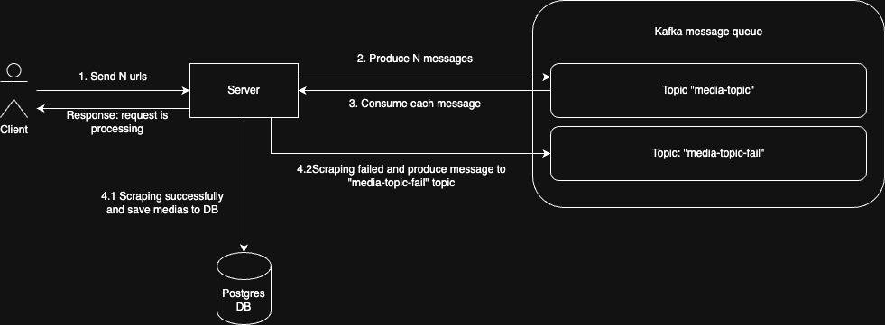
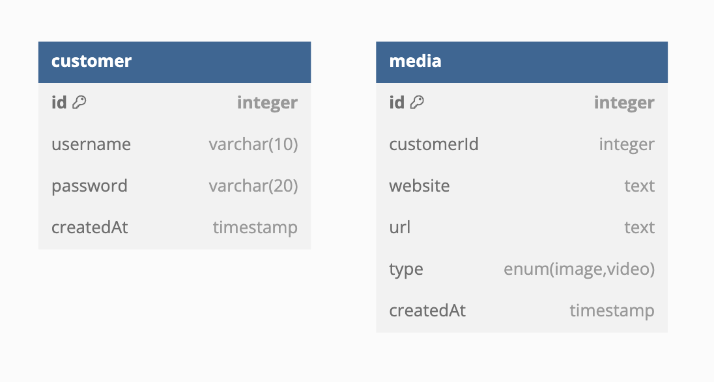

# Media Scraper

## Overview

Media scraper using `puppeteer` to scrape medias from websites.

### Architecture



The platform leverages the Kafka message queue for the following reasons:

1. When end users request a large number of websites to be scraped, they don't have to wait for all websites to be processed. Scraping is a time-consuming task and this approach ensures a better user experience.
2. Given the server's limited resources, processing each website asynchronously helps reduce the risk of server downtime and improves overall system efficiency.
3. It is not necessary to display all scraped images immediately, so this architecture allows for delayed processing and optimized resource utilization.
4. Any messages that fail to be consumed will be sent to the `media-topic-fail` topic for analysis purposes.

### Entities



Notes:

- Customer Entity: The `username` field is indexed as unique, and hashed passwords are securely stored in the database.
- Media Entity: Since filtering will occur based on `type` and searches will be performed using `website`, the `type` and `website` columns will be indexed for improved query performance.

## Installation

### 1. Install docker and docker-compose

### 2. Clone this repository

### 3. Run the app

Inside the root folder, run this command

```bash
docker compose up
```

Wait until the client service started then we are good to go.

## Step by step tutorial

### Get authenticated token

#### Sign up

```bash
curl
--location 'http://localhost:8080/auth/sign-up' \
--header 'Content-Type: application/json' \
--data '{
    "username": "username",
    "password": "123456"
}'
```

#### Sign in

```bash
curl
--location 'http://localhost:8080/auth/sign-in' \
--header 'Content-Type: application/json' \
--data '{
    "username": "username",
    "password": "123456"
}'
```

### Select website urls to scrape from

```bash
curl
--location 'http://localhost:8080/media/import' \
--header 'Authorization: Bearer {TOKEN}' \
--header 'Content-Type: application/json' \
--data '{
    "urls": [
        "https://www.stadiumcreativegroup.com/",
        "https://an-pham.com/",
        "https://www.flashscore.com/"
    ]
}'
```

### Get medias

#### via API

```bash
curl --location 'http://localhost:8080/media?page=1&limit=12&type=image&search=name'
```

#### via webpage

Visit http://localhost:3000

## Demo
